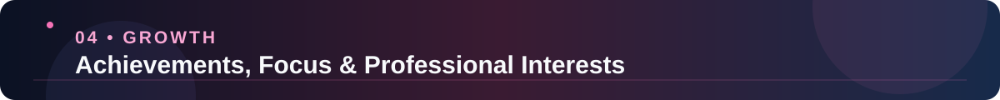
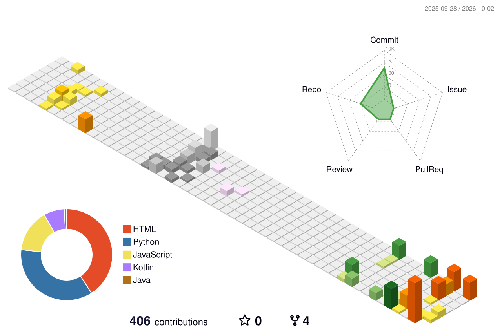

<!-- ================================================================= -->
<!--          RAJENDER MOHAN VERMA — MASTER DEVELOPER PROFILE          -->
<!-- ================================================================= -->

# ⚡ RAJENDER MOHAN VERMA ⚡

**MCA Student @ JIMS, Rohini • Full-Stack Software Developer • Python • Java • Web Systems**

  

<!-- Live Typing Headline -->

  

<!-- Primary Action Badges -->

  
  
  

<!-- Status & Live Visitor Metrics -->

  
  
  
  

<!-- Quick Section Jump Navigation -->

  
  
  
  
  

---

<!-- ================================================================= -->
<!--                         01 / ABOUT ME                             -->
<!-- ================================================================= -->

  

  

### 👋 About Me & Engineering Philosophy

I am a **BCA graduate** and currently pursuing my **Master of Computer Applications (MCA) at JIMS, Rohini, Delhi**. I specialize in creating robust web systems, database-backed applications, and scalable backend services with clean code and intuitive user interfaces.

- 🎓 **MCA — Currently Pursuing** at **Jagan Institute of Management Studies (JIMS), Rohini, Delhi**
- 🎓 **BCA — Graduated** from **Don Bosco Institute of Technology (DBIT), GGSIPU, Delhi**
- 💻 **Full-Stack Engineering:** Proficient in designing end-to-end architectures from database design to API services and responsive frontends.
- 🧠 **Algorithms & Problem Solving:** Passionate about Data Structures & Algorithms with consistent daily practice and competitive coding streaks.
- 🔧 **Production Mindset:** Experienced in building production-ready applications with user authentication, role-based workflows, third-party integrations, and cloud deployment.
- 🌱 **Continuous Evolution:** Driven by curious exploration of modern frameworks, AI integrations, and high-performance software engineering.

---

<!-- ================================================================= -->
<!--                         02 / TECH STACK                           -->
<!-- ================================================================= -->

  

  

<table width="100%">
<tr>
<td width="50%" valign="top">

#### 💻 Languages & Fundamentals
* **Languages:** Python, Java, C++, JavaScript (ES6+)
* **Core:** Data Structures & Algorithms, Object-Oriented Programming (OOP), RESTful API Design

#### 🌐 Frontend Development
* **Frameworks & UI:** React.js, Angular, HTML5, CSS3, JavaScript
* **Styling & Layout:** Responsive Web Design, Bootstrap, Modern Flexbox/Grid

</td>
<td width="50%" valign="top">

#### ⚙️ Backend & Frameworks
* **Python Backends:** Django, Flask, Flask-SocketIO, Flask-Login
* **JavaScript Backends:** Node.js, Express.js
* **Databases & ORM:** PostgreSQL, MySQL, SQLite, Prisma, SQLAlchemy

#### 🛠️ Tooling & Cloud Deployment
* **Developer Tools:** Git, GitHub, VS Code, Postman, Android Studio, Figma
* **Deployment & Cloud:** Vercel, Render, Streamlit Cloud, Neon PostgreSQL

</td>
</tr>
</table>

---

<!-- ================================================================= -->
<!--                      03 / FEATURED PROJECTS                       -->
<!-- ================================================================= -->

  

> **"Real projects • Practical engineering • Measurable impact"**

---

### 🎓 01 — Alumni Hub
**Academic Connection & Mentorship Network**

An enterprise-grade academic networking platform bridging the communication and opportunity gap between current university students, alumni, and faculty.

* 🔹 **Key Capabilities:** Role-based dashboards (Student, Alumni, Faculty, Admin), real-time peer messaging with SocketIO, job/internship board, secure OTP authentication, and automated admin analytics.
* 🔹 **Architecture:** Multi-role relational database design, secure session management, and scikit-learn recommendation support.
* 🛠️ **Tech Stack:** `Python` • `Flask` • `Flask-SocketIO` • `Flask-Login` • `SQLite` • `scikit-learn` • `NumPy` • `Bootstrap` • `JavaScript`

  
  

---

### 🅿️ 02 — SmartPark
**Intelligent Parking Management System**

A full-stack urban mobility application that simplifies finding, booking, and managing parking spaces with contactless verification.

* 🔹 **Key Capabilities:** Real-time parking slot availability, live pricing & duration estimation, dynamic QR check-in & check-out passes, and automated PDF receipt generation for drivers and administrators.
* 🔹 **Architecture:** Cloud database connected via SQLAlchemy to PostgreSQL on Neon, ensuring ACID transactions and instant slot state sync.
* 🛠️ **Tech Stack:** `Python` • `Flask` • `SQLAlchemy` • `PostgreSQL (Neon)` • `SQLite` • `Bootstrap` • `JavaScript` • `QR & PDF APIs` • `Vercel`

  
  

---

### ♻️ 03 — Kabadivala
**AI-Powered Traceable Waste & Recycling Platform**

A production-grade circular economy platform that brings full digital traceability to waste collection, processing, and recycling supply chains.

* 🔹 **Key Capabilities:** 5-tier role workspaces (Customer, Collector, Hub, Recycler, Admin), AI visual waste identification using Gemini Vision API, pickup scheduling, batch QR handoffs, digital certificates, and green reward points.
* 🔹 **Architecture:** Modern decoupled stack utilizing React/Vite frontend with an Express/Node backend, secured with JWT and Prisma ORM on PostgreSQL.
* 🛠️ **Tech Stack:** `React.js` • `Vite` • `Node.js` • `Express.js` • `PostgreSQL` • `Prisma ORM` • `JWT` • `Zod` • `Gemini Vision API` • `Render` • `Vercel`

  
  

---

### 🤖 04 — AI Resume Analyzer
**Intelligent Career Readiness & Resume Evaluation Tool**

An intelligent web application that evaluates uploaded resumes against current tech industry hiring criteria, providing structured scoring and actionable recommendations.

* 🔹 **Key Capabilities:** Instant document parsing, keyword matching, strength & weakness breakdown, and section-by-section improvement advice for software engineering applicants.
* 🔹 **Architecture:** Rapid interactive deployment using Streamlit with underlying NLP/ML text parsing modules.
* 🛠️ **Tech Stack:** `Python` • `Streamlit` • `NLP` • `Text Parsing` • `Machine Learning` • `Streamlit Cloud`

  
  

---

### 🧠 05 — Python Quiz App
**Interactive Timed Python Mastery Platform**

A dynamic learning and assessment web application designed to help developers sharpen Python concepts through timed quizzes and immediate diagnostic analytics.

* 🔹 **Key Capabilities:** Dynamic question banks categorized by difficulty, real-time countdown timer, automated score calculation, and review screens with answer rationales.
* 🔹 **Architecture:** Robust Django backend with clean MVC separation and responsive mobile-first UI.
* 🛠️ **Tech Stack:** `Python` • `Django` • `HTML5` • `CSS3` • `JavaScript` • `Vercel`

  
  

---

<!-- ================================================================= -->
<!--                     04 / BUILDER CREDENTIALS                      -->
<!-- ================================================================= -->

  

<table width="100%">
<tr>
<td width="55%" valign="top">

### 🏆 Achievements & Badges

* 🥇 **LeetCode 200 Days Badge — 2026**
* 🥇 **LeetCode 100 Days Badge — 2025**
* 🥇 **LeetCode 50 Days Badge**
* 🏅 **LeetCode DCC Milestone** — September & October 2025
* 🚀 **Smart India Hackathon (SIH) 2025** — Certificate of Appreciation
* 📊 **National Financial Literacy Quiz 2026** — NISM / SEBI
* 🤖 **Mission Upskill India / AI Impact Summit 2026** — HCL GUVI & MeitY
* 🎓 **Simplilearn** — Introduction to Front-End Development
* 💻 **ExcelR** — 30-Hour Intensive DSA Program
* 🧪 **OneRoadmap Frontend Assessment** — 75% Score
* 🌐 **SkillCup Community** — Google Student Ambassador Session

</td>
<td width="45%" valign="top">

### 🎯 Current Engineering Focus

* 🔥 **Advanced Full-Stack Engineering:** Deepening mastery in modular microservices and modern React ecosystems.
* 🐍 **Production Backends:** Crafting secure and test-driven architectures with Python (Django, Flask) & Node.js.
* ☕ **Data Structures & Algorithms:** Maintaining strong problem-solving proficiency in Java and C++.
* 🗄️ **Relational Databases & Indexing:** Optimizing SQL queries, transactions, and schema normalization in PostgreSQL.
* 🚀 **Shipping Real-World Utility:** Building and deploying practical tools that solve tangible user problems.

</td>
</tr>
</table>

### 📊 GitHub Contribution Metrics & Streak

  

### 🧊 3D Contribution Activity

  

### 🐍 GitHub Contribution Snake

  <picture>
    <source media="(prefers-color-scheme: dark)" srcset="./assets/contribution-snake/github-contribution-grid-snake-dark.svg">
    <source media="(prefers-color-scheme: light)" srcset="./assets/contribution-snake/github-contribution-grid-snake.svg">
    
  </picture>

---

<!-- ================================================================= -->
<!--                         05 / LET'S CONNECT                        -->
<!-- ================================================================= -->

  

<table>
<tr>
<td width="36%" align="center" valign="middle">
  
</td>
<td width="64%" valign="middle">

### 🤝 Let's build something exceptional together!

I am always keen to explore **collaborative projects, full-stack development, software engineering internships, open-source initiatives**, or discussions around Python, Web Systems, and algorithmic problem-solving.

Feel free to connect or drop a line across any of my channels:

  

  
  
  
  

> **"Learn → Build → Test → Improve → Deploy → Repeat."**

</td>
</tr>
</table>

---

  <b>⭐ Thank you for visiting my GitHub Profile! ⭐</b> 
  💙 Keep learning. Keep building. Keep growing.

  

