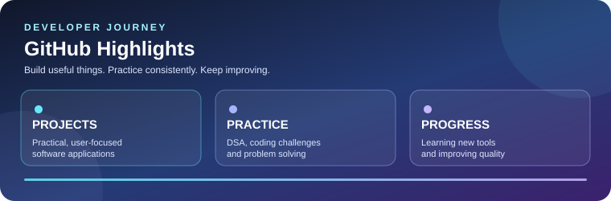

<!-- ========================================================= -->
<!--                    DEVELOPER PROFILE                        -->
<!-- ========================================================= -->

# RAJENDER MOHAN VERMA

**MCA Student • Full-Stack Developer • Python • Java • Web**

  

  

  
  
  

  
  
  
  

  
  
  
  
  

---

## 01 / ABOUT

  

  

### 👋 About Me

I'm a **BCA graduate** and currently pursuing **MCA at JIMS, Rohini**. I enjoy building practical software solutions, responsive web applications and user-focused digital experiences.

<table>
<tr>
<td width="50%" valign="top">

### 🎯 What I Build

- 🚀 Full-stack web applications
- 🐍 Python and Java software solutions
- 🗄️ Database-driven systems & REST APIs
- 💡 Interactive student & community platforms
- 🧩 Practical problem-solving tools
- 📦 Reliable, deployable & user-focused products

</td>
<td width="50%" valign="top">

### 🧭 My Direction

- 🎓 **MCA — Currently Pursuing** at **JIMS, Rohini**
- 🎓 **BCA — Completed** from **Don Bosco Institute of Technology (DBIT), Delhi**
- 💻 **Full-Stack Development** with modern frameworks
- 🧠 **DSA & algorithmic problem solving**
- 🔧 End-to-end frontend, backend, APIs and deployment
- 🌱 Continuous learning by building and shipping

</td>
</tr>
</table>

### ✨ Quick Highlights

- 🌐 **Frontend:** HTML5, CSS3, JavaScript (ES6+), React, Angular, Bootstrap
- 🐍 **Backend:** Python, Django, Flask, Node.js, Express.js
- ☕ **Programming Languages:** Python, Java, C++, JavaScript
- 🗄️ **Databases:** MySQL, PostgreSQL, SQLite, SQL
- 📱 **Mobile:** Android Development with Java / Kotlin
- 🧰 **Tools & Workflows:** Git, GitHub, VS Code, Postman, Figma
- ☁️ **Deployment & Cloud:** Vercel, Render, Streamlit Cloud
- 📊 **Additional:** Data Structures & Algorithms, MS Excel, basic data analysis

---

## 02 / STACK

  

### 🛠️ Technology Lab

#### 💻 Programming Languages

  

#### 🌐 Frontend Development

  

#### 🖥️ Backend & Frameworks

  

#### 🗄️ Databases

  

#### 📱 Mobile • Tools • Deployment

  

**Core:** Python • Java • C++ • JavaScript • HTML • CSS

**Web:** Flask • Django • React • Node.js • Express.js • Bootstrap

**Data:** MySQL • PostgreSQL • SQLite • SQL

**Tools:** Git • GitHub • VS Code • Postman • Vercel • Android Studio • Figma

---

## 03 / PROJECT LAB

  

> **Real projects • Practical problems • Full-stack thinking**

### 📋 Overview Comparison

| Project | What it does | Stack | Links |
|---|---|---|---|
| **Alumni Hub** | Academic community platform connecting students, alumni and faculty | Python, Flask, SocketIO, SQLite, Bootstrap | [Live Demo](https://alumni-hub-195.vercel.app/) · [GitHub](https://github.com/RajenderMohanVerma/dbit-alumni-hub) |
| **SmartPark** | Parking discovery, reservation, QR check-in/out and management | Flask, SQLAlchemy, PostgreSQL/SQLite, Bootstrap | [Live Demo](https://smart-parking-three-henna.vercel.app/) · [GitHub](https://github.com/RajenderMohanVerma/SmartParking) |
| **Kabadivala** | Traceable recycling workflow across customer, collector, hub and recycler roles | React, Node, Express, PostgreSQL, Prisma, Gemini Vision | [Live Demo](https://kabadiwala-26.vercel.app/) · [GitHub](https://github.com/RajenderMohanVerma/Kabadiwala) |
| **AI Resume Analyzer** | Resume upload and AI-assisted structured feedback | Python, Streamlit, AI/ML | [Live Demo](https://ai-resume-analyzer-734.streamlit.app/) · [GitHub](https://github.com/RajenderMohanVerma/AI-Resume-Analyzer) |
| **Python Quiz App** | Timed Python practice quiz with automatic results | Python, Django, HTML, CSS, JavaScript | [Live Demo](https://python-quiz-three.vercel.app/) · [GitHub](https://github.com/RajenderMohanVerma/Python_Quiz) |

---

### 🎓 01 — Alumni Hub

**Alumni Connection Network**

A Flask-based platform connecting students, alumni and faculty through networking, career opportunities and communication.

<table>
<tr><th>WHAT IT DOES</th><th>FOCUS</th></tr>
<tr><td>Role-based academic community</td><td>Networking + Communication</td></tr>
<tr><td>Messaging, connections and career board</td><td>Real-time interaction</td></tr>
<tr><td>OTP verification, recommendations and notifications</td><td>Security + Smart features</td></tr>
<tr><td>Admin analytics and CSV reporting</td><td>Management + Insights</td></tr>
</table>

**Tech:** Python, Flask, Flask-Login, Flask-SocketIO, SQLite, scikit-learn, NumPy, Bootstrap, JavaScript

---

### 🅿️ 02 — SmartPark

**Smart Parking Management System**

A full-stack parking platform for finding spaces, reserving slots and managing parking entry and exit.

<table>
<tr><th>WHAT IT DOES</th><th>FOCUS</th></tr>
<tr><td>Parking search and slot availability</td><td>Smart booking</td></tr>
<tr><td>Reservations and fee estimation</td><td>Parking workflow</td></tr>
<tr><td>QR-based passes with check-in/check-out</td><td>Verification</td></tr>
<tr><td>PDF receipts, history and admin management</td><td>Operations</td></tr>
</table>

**Tech:** Python, Flask, SQLAlchemy, PostgreSQL/Neon, SQLite, Bootstrap, JavaScript, QR/PDF generation, Vercel

---

### ♻️ 03 — Kabadivala

**Traceable Recycling Platform**

A role-based recycling platform connecting customers, collectors, hubs and recyclers from pickup booking to recycling completion.

<table>
<tr><th>WHAT IT DOES</th><th>FOCUS</th></tr>
<tr><td>Customer, Collector, Hub, Recycler and Admin workspaces</td><td>Multi-role workflow</td></tr>
<tr><td>Pickup scheduling and AI-assisted item identification</td><td>Automation + AI</td></tr>
<tr><td>Weight verification, eco points and complaints</td><td>Trust + Engagement</td></tr>
<tr><td>QR material handoffs, inventory and certificates</td><td>Traceability</td></tr>
</table>

**Tech:** React, Vite, React Router, Node.js, Express.js, PostgreSQL, Prisma, JWT, Zod, Multer, Gemini Vision API, PDF/QR generation, Vercel, Render

---

### 🤖 04 — AI Resume Analyzer

**AI-powered Resume Analysis**

An AI-powered web application that analyzes uploaded resumes and provides structured feedback to help users improve them.

<table>
<tr><th>WHAT IT DOES</th><th>FOCUS</th></tr>
<tr><td>Resume upload and analysis</td><td>AI-assisted evaluation</td></tr>
<tr><td>Structured feedback across sections</td><td>Clarity + Quality</td></tr>
<tr><td>Practical improvement suggestions</td><td>Career readiness</td></tr>
<tr><td>Simple Streamlit interface</td><td>Accessible UX</td></tr>
</table>

**Tech:** Python, Streamlit, AI/ML-based resume analysis

---

### 🧠 05 — Python Quiz App

**Django-based Python Practice Platform**

An interactive Django quiz application that helps users practice Python with timed questions and automatic results.

<table>
<tr><th>WHAT IT DOES</th><th>FOCUS</th></tr>
<tr><td>Dynamic Python quiz questions</td><td>Learning</td></tr>
<tr><td>Timed quiz experience</td><td>Engagement</td></tr>
<tr><td>Automatic scoring and results</td><td>Instant feedback</td></tr>
<tr><td>Responsive learning interface</td><td>Accessibility</td></tr>
</table>

**Tech:** Python, Django, HTML, CSS, JavaScript

---

## 04 / BUILDER CREDENTIALS & GROWTH

  

### 🏆 Achievements & Certifications

- 🥇 **LeetCode 200 Days Badge — 2026**
- 🥇 **LeetCode 100 Days Badge — 2025**
- 🥇 **LeetCode 50 Days Badge**
- 🏅 **LeetCode DCC — September & October 2025**
- 🚀 **Smart India Hackathon 2025 — Certificate of Appreciation**
- 📊 **National Financial Literacy Quiz 2026 — NISM/SEBI**
- 🤖 **Mission Upskill India / AI Impact Summit 2026 — HCL GUVI + MeitY**
- 🎓 **Simplilearn — Introduction to Front-End Development**
- 💻 **ExcelR — 30-Hour DSA Program**
- 🧪 **OneRoadmap Frontend Test — 75% Score**
- 🌐 **SkillCup Community — Google Student Ambassador Session**

### 📊 GitHub Activity

  

  
  

  

### 🧊 3D Contribution Activity

  

### 🐍 Contribution Snake

  <picture>
    <source media="(prefers-color-scheme: dark)" srcset="./assets/contribution-snake/github-contribution-grid-snake-dark.svg">
    <source media="(prefers-color-scheme: light)" srcset="./assets/contribution-snake/github-contribution-grid-snake.svg">
    
  </picture>

### 🎯 Current Focus

<table>
<tr>
<td width="50%" valign="top">

- 🔥 Improving **Full-Stack Development**
- 🐍 Building stronger applications with **Python, Django and Flask**
- ☕ Strengthening **Java and problem-solving**
- 🌐 Exploring **React, Node.js and modern web development**

</td>
<td width="50%" valign="top">

- 🗄️ Improving database design and SQL
- 🧠 Practicing **DSA and coding problems**
- 🚀 Building and deploying practical projects
- 🌱 Continuously learning through implementation

</td>
</tr>
</table>

### 💼 Professional Interests

  
  
  
  

---

## 05 / CONNECT

  

### 🤝 Let's Connect

  
  
  
  
  

<table align="center">
<tr>
<td align="center"><b>LEARN</b> Keep exploring.</td>
<td align="center">→</td>
<td align="center"><b>BUILD</b> Solve real problems.</td>
<td align="center">→</td>
<td align="center"><b>SHIP</b> Deploy and improve.</td>
</tr>
</table>

### 💭 Development Philosophy

> **Learn → Build → Test → Improve → Deploy → Repeat.**

I believe the best way to learn technology is by building real projects, solving practical problems and continuously improving the quality of the solution.

---

  <b>⭐ Thanks for visiting my GitHub profile! ⭐</b> 
  💙 Keep learning. Keep building. Keep growing.

  

